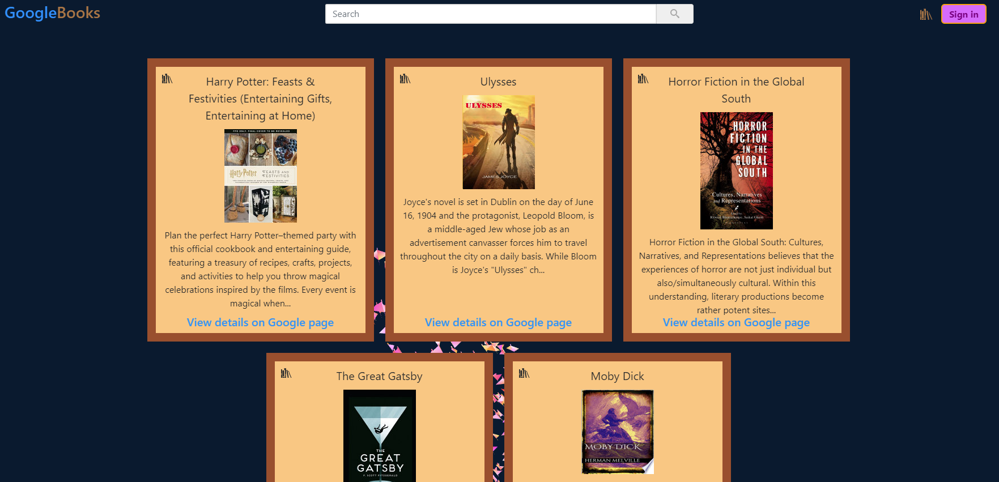
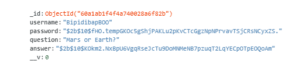

## Google books search - React app

Ever wanted to search for a book through google with a youtube inspired navbar? Tadda! Googlebooksapi9000: signin, save books for later, delete some, or click the "view more details" link and be redirected to an understandibly less stylish/less cpu consuming website to do what you desire.

## Live application

https://googlebooksapi9000.herokuapp.com/

## Running the tests

There were no automated tests during the process of this application. 

## Built With

* [MongoDB](https://www.mongodb.com/) - Cloud database
* [Mongoose](https://mongoosejs.com/) - Mongodb object modeling for node.js
* [Express](https://expressjs.com/) - Web freamework for node.js
* [React](https://reactjs.org/) - A Javascript library for building user interfaces
* [React-Hooks](https://reactjs.org/docs/hooks-intro.html) - Use state and other features without writing a class
* [Nodejs](https://nodejs.org/en/) - Used to launch the application
* [Google-Books-API](https://developers.google.com/books) - Used to fetch book information
* [Bootstrap](https://getbootstrap.com/) - Styling toolkit
* [Bcrypt](https://www.npmjs.com/package/bcrypt) - Used to hash passwords
* [JSON-web-token](https://jwt.io/) - Used to decode, verify and generate safety JWT token
* [react-icons](https://react-icons.github.io/react-icons/search) - Used for multiple icons on the site

## Contributing

There are many ways in which you can participate in the project, for example: 
* Submit bugs and feature requests to the email below, and help us verify as they are checked in 
* Review source code changes
* Review the documentation and make pull requests for anything from typos to new content

## Authors

Sole author

## License

This project is licensed under the MIT License

## Questions

For any additional questions see my [GitHub profile](http://github.com/tylerpetri) or contact tylerpetri93@gmail.com
